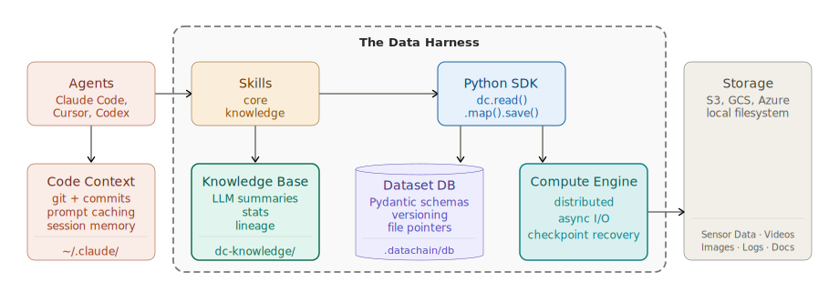

#  DataChain: The Context Layer for Unstructured Data

[](https://pypi.org/project/datachain/)
[](https://pypi.org/project/datachain)
[](https://codecov.io/gh/datachain-ai/datachain)
[](https://github.com/datachain-ai/datachain/actions/workflows/tests.yml)
[](https://deepwiki.com/datachain-ai/datachain)

**A Python library that turns files in S3, GCS, and Azure into versioned, typed datasets, queryable at warehouse speed.**

- **Compute Engine**: parallel and distributed Python over files. Async I/O, checkpoint recovery, incremental updates.
- **Dataset DB**: Pydantic schemas, versioning, file pointers, automatic lineage. Sub-second filter, join, and similarity search over hundreds of millions of records.

Optional, for agent workflows:

- **Knowledge Base**: markdown summaries derived from the Dataset DB and enriched by LLM. Readable by humans and LLMs.
- **Agent Harness**: skill and MCP server that plug all three into Claude Code, Cursor, and Codex, so they understand your data.

Bytes never leave your storage. Every run deposits a typed dataset the next pipeline (or agent) reads instead of recomputing.

## 1. Install

```bash
pip install datachain
```

To add the agent skill (Knowledge Base + code generation):

```bash
datachain skill install --target claude     # also: --target cursor, --target codex
```

Works with S3, GCS, Azure, and local filesystems.

## 2. Quickstart: agent-driven pipeline

Task: find dogs in S3 similar to a reference image, filtered by breed, mask availability, and image dimensions.

Grab a reference image and run Claude Code (or other agent):
```bash
datachain cp --anon s3://dc-readme/fiona.jpg .

claude
```

Prompt:
```prompt
Find dogs in s3://dc-readme/oxford-pets-micro/ similar to fiona.jpg:
  - Pull breed metadata and mask files from annotations/
  - Exclude images without mask
  - Exclude Cocker Spaniels
  - Only include images wider than 400px
```

Result:
```
  ┌──────┬───────────────────────────────────┬────────────────────────────┬──────────┐
  │ Rank │               Image               │           Breed            │ Distance │
  ├──────┼───────────────────────────────────┼────────────────────────────┼──────────┤
  │    1 │ shiba_inu_52.jpg                  │ shiba_inu                  │    0.244 │
  ├──────┼───────────────────────────────────┼────────────────────────────┼──────────┤
  │    2 │ shiba_inu_53.jpg                  │ shiba_inu                  │    0.323 │
  ├──────┼───────────────────────────────────┼────────────────────────────┼──────────┤
  │    3 │ great_pyrenees_17.jpg             │ great_pyrenees             │    0.325 │
  └──────┴───────────────────────────────────┴────────────────────────────┴──────────┘

  Fiona's closest matches are shiba inus (both top spots), which makes sense given her
  tan coloring and pointed ears.
```

The agent decomposed the task into steps - embeddings, breed metadata, mask join, quality filter - and saved each as a named, versioned dataset. Next time you ask a related question, it starts from what's already built.

The datasets are registered in a Knowledge Base optimized for both agents and humans:

```bash
dc-knowledge
├── buckets
│   └── s3
│       └── dc_readme.md
├── datasets
│   ├── oxford_micro_dog_breeds.md
│   ├── oxford_micro_dog_embeddings.md
│   └── similar_to_fiona.md
└── index.md
```

Browse it as markdown files, navigate with wikilinks, or open in [Obsidian](https://obsidian.md/):


## 3. Data Harness

Code harnesses (Claude Code, Cursor, Codex) give agents repo context, dedicated tools, and memory across sessions. DataChain adds the same for data: typed datasets the agent reads, chain operations the agent calls (`read_storage`, `map`, `save`), a Dataset DB where its results persist.

<p align="center">
  
</p>

A **dataset** is the unit of work - a named, versioned result of a pipeline step like `pets_embeddings@1.0.0`. Every `.save()` registers one.

For the data-flow architecture (Compute Engine, Dataset DB, Knowledge Base) and how the components connect, see [Architecture](https://docs.datachain.ai/architecture/).


## 4. Core concepts

### 4.1. Dataset

A dataset is a versioned data reasoning step - what was computed, from what input, producing what schema. DataChain indexes your storage into one: no data copied, just typed metadata and file pointers. Re-runs only process new or changed files.

Create a dataset manually `create_dataset.py`:
```python
from PIL import Image
import io
from pydantic import BaseModel
import datachain as dc

class ImageInfo(BaseModel):
    width: int
    height: int

def get_info(file: dc.File) -> ImageInfo:
    img = Image.open(io.BytesIO(file.read()))
    return ImageInfo(width=img.width, height=img.height)

ds = (
    dc.read_storage(
        "s3://dc-readme/oxford-pets-micro/images/**/*.jpg",
        anon=True,
        update=True,
        delta=True,         # re-runs skip unchanged files
    )
    .settings(prefetch=64)
    .map(info=get_info)
    .save("pets_images")
)
ds.show(5)
```

`pets_images@1.0.0` is now the shared reference to this data - schema, version, lineage, and metadata.

Every `.save()` registers the dataset in the **Dataset DB**, DataChain's persistent store for schemas, versions, lineage, and processing state, kept locally in SQLite DB `.datachain/db`. Pipelines reference datasets by name, not paths. When the code or input data changes, the next run bumps dataset version.

This is what makes a **dataset a management unit:** owned, versioned, and queryable by everyone on the team.

### 4.2. Schemas and types

DataChain uses Pydantic to define the shape of every column. The return type of your UDF becomes the dataset schema - each field a queryable column in the Dataset DB.

`show()` in the previous script renders nested fields as dotted columns:

```bash
                                          file    file  info   info
                                          path    size width height
0  oxford-pets-micro/images/Abyssinian_141.jpg  111270   461    500
1  oxford-pets-micro/images/Abyssinian_157.jpg  139948   500    375
2  oxford-pets-micro/images/Abyssinian_175.jpg   31265   600    234
3  oxford-pets-micro/images/Abyssinian_220.jpg   10687   300    225
4    oxford-pets-micro/images/Abyssinian_3.jpg   61533   600    869

[Limited by 5 rows]
```

`.print_schema()` renders it's schema:
```bash
file: File@v1
  source: str
  path: str
  size: int
  version: str
  etag: str
  is_latest: bool
  last_modified: datetime
  location: Union[dict, list[dict], NoneType]
info: ImageInfo
  width: int
  height: int
```

Models can be arbitrarily nested - a `BBox` inside an `Annotation`, a `List[Citation]` inside an LLM Response - every leaf field stays queryable the same way. The schema lives in the Dataset DB and is enforced at dataset creation time.

The Dataset DB handles datasets of any size - 100 millions of files, hundreds of metadata rows - without loading anything into memory. **Pandas is limited by RAM; DataChain is not.** Export to pandas when you need it, on a filtered subset:

```python
import datachain as dc

df = dc.read_dataset("pets_images").filter(dc.C("info.width") > 500).to_pandas()
print(df)
```

### 4.3. Fast queries

Filters, aggregations, and joins run as vectorized operations directly against the Dataset DB - metadata never leaves your machine, no files downloaded.

```python
import datachain as dc

cnt = (
    dc.read_dataset("pets_images")
    .filter(
        (dc.C("info.width") > 400) &
        ~dc.C("file.path").ilike("%cocker_spaniel%")   # case-insensitive
    )
    .count()
)
print(f"Large images with Cocker Spaniel: {cnt}")
```

Milliseconds, even at 100M-file scale.
```
Large images with Cocker Spaniel: 6
```

## 5. Resilient Pipelines

When computation is expensive, bugs and new data are both inevitable. DataChain tracks processing state in the Dataset DB - so crashes and new data are handled automatically, without changing how you write pipelines.

### 5.1. Data checkpoints

Save to `embed.py`:
```python
import open_clip, torch, io
from PIL import Image
import datachain as dc

model, _, preprocess = open_clip.create_model_and_transforms("ViT-B-32", "laion2b_s34b_b79k")
model.eval()

counter = 0

def encode(file: dc.File, model, preprocess) -> list[float]:
    global counter
    counter += 1
    if counter > 236:                                    # ← bug: remove these two lines
        raise Exception("some bug")                      # ←
    img = Image.open(io.BytesIO(file.read())).convert("RGB")
    with torch.no_grad():
        return model.encode_image(preprocess(img).unsqueeze(0))[0].tolist()

(
    dc.read_dataset("pets_images")
    .settings(batch_size=100)
    .setup(model=lambda: model, preprocess=lambda: preprocess)
    .map(emb=encode)
    .save("pets_embeddings")
)
```

It fails due to a bug in the code:
```
Exception: some bug
```

Remove the two marked lines and re-run - DataChain resumes from image 201 (two 100 size batches are completed), the start of the last uncommitted batch:

```
$ python embed.py
UDF 'encode': Continuing from checkpoint
```

### 5.2. Similarity search

The vectors live in the Dataset DB alongside all the metadata - `list[float]` type in pydentic schemas. Querying them is instant - no files re-read and can be combined with not vector filters like `info.width`:

Prepare data:
```bash
datachain cp s3://dc-readme/fiona.jpg .
```

`similar.py`:
```python
import open_clip, torch, io
from PIL import Image
import datachain as dc

model, _, preprocess = open_clip.create_model_and_transforms("ViT-B-32", "laion2b_s34b_b79k")
model.eval()

ref_emb = model.encode_image(
    preprocess(Image.open("fiona.jpg")).unsqueeze(0)
)[0].tolist()

(
    dc.read_dataset("pets_embeddings")
    .filter(dc.C("info.width") > 500)          # from pets_images - no re-read
    .mutate(dist=dc.func.cosine_distance(dc.C("emb"), ref_emb))
    .order_by("dist")
    .limit(3)
    .show()
)
```

Under a second - everything runs against the Dataset DB.


### 5.3. Incremental updates

The bucket in this walkthrough is static, so there's nothing new to process. But in production - when new images land in your bucket - re-run the same scripts unchanged. `delta=True` in the original dataset ensures only new files are processed end to end while the whole dataset will be updated to `pets_images@1.0.1`:

```python
$ python create_dataset.py   # 500 new images arrived
Skipping 10,000 unchanged  ·  indexing 500 new
Saved pets_images@1.0.1  (+500 records)

# Next day:

$ python create_dataset.py
Skipping 10,000 unchanged  ·  processing 500 new
Saved pets_images@1.0.2  (+500 records)
```

## 6. Knowledge Base

DataChain maintains two layers. The **Dataset DB** is the ground truth: schemas, processing state, lineage, the vectors themselves. **The Knowledge Base** is derived from it: structured markdown for humans and agents to read. Because it's derived, it's always accurate. The Knowledge Base is stored in `dc-knowledge/`.

Ask the agent to build it (from Calude Code, Codex or Cursor):
```bash
claude
```

Prompt:
```prompt
Build a Knowledge Base for my current datasets
```

The skill generates `dc-knowledge/` directory from the Dataset DB - one file per dataset and bucket:


## 7. AI-Generated Pipelines

The skill gives the agent data awareness: it reads `dc-knowledge/` to understand what datasets exist, their schemas, which fields can be joined - and the meaning of columns inferred from the code that produced them.

See section `2. Quickstart: agent-driven pipeline` above. All the steps that were manually created could be just generated.


## 8. Team and cloud: Studio

Data context built locally stays local. DataChain Studio makes it shared.

```bash
datachain auth login
datachain job run --workers 20 --cluster gpu-pool caption.py
# ✓ Job submitted → studio.datachain.ai/jobs/1042
# Resuming from checkpoint (4,218 already done)...
# Saved oxford-pets-caps@0.0.1  (3,182 processed)
```

<p align="center">
  
</p>

Studio adds: shared dataset registry, access control, UI for video/DICOM/NIfTI/point clouds, lineage graphs, reproducible runs.

Bring Your Own Cloud - all data and compute stay in your infrastructure. AWS, GCP, Azure, on-prem Kubernetes.

→ [studio.datachain.ai](https://studio.datachain.ai)

## 9. Contributing

Contributions are very welcome. To learn more, see the [Contributor Guide](https://docs.datachain.ai/contributing).

## 10. Community and Support

- [Report an issue](https://github.com/datachain-ai/datachain/issues) if you encounter any problems
- [Docs](https://docs.datachain.ai/)
- [Email](mailto:support@datachain.ai)
- [Twitter](https://twitter.com/datachain_ai)
