# <a class="main-header-link" href="/" >  DataChain</a>

The Context Layer for unstructured data

  
  
  
  

The Model Floor Is the Same for Everyone. The Context Ceiling Is Yours.

**A Python library that turns files in S3, GCS, and Azure into versioned, typed datasets, queryable at warehouse speed.**

Bytes never leave your storage. Two core components: a **Compute Engine** for distributed Python over files and a **Dataset DB** for warehouse-speed queries over Pydantic-typed records. For agent workflows, two more: a **Knowledge Base** of markdown summaries and an **Agent Harness** (skill + MCP) that plugs all of it into Claude Code, Cursor, and Codex, so they understand your data.

## Get started

- **[🤖 Agents](getting-started/agents.md)** - knowledge base for Claude Code, Codex, and Cursor
- **[🐍 Python](getting-started/python.md)** - full control over data processing
- **[💡 Concepts](concepts/index.md)** - the Dataset DB, the Compute Engine, and the Knowledge Base
- **[🧩 Use Cases](use-cases/index.md)** - patterns where the harness changes the work

  

